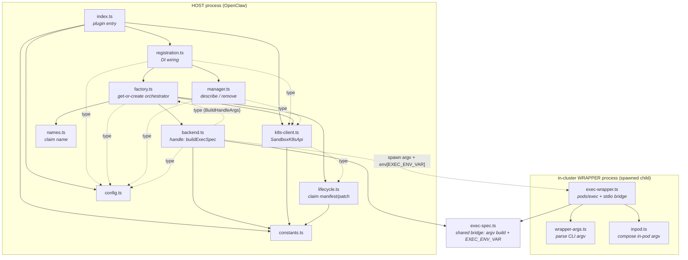

# Architecture — module relationships

This plugin has **two entry points that run in two separate processes**, sharing a
small set of pure leaf modules. Understanding that split is the key to the codebase.

| Process | Root | Role |
| --- | --- | --- |
| **HOST** (OpenClaw's own process) | `index.ts` | Plugin entry; registers the backend; the backend handle builds the argv/env for an exec |
| **in-cluster WRAPPER** (a child process OpenClaw spawns) | `src/exec-wrapper.ts` | Opens the websocket `pods/exec` into the target Pod and bridges stdio/PTY |

The HOST never talks to the Pod directly. Its `buildExecSpec` returns an argv like
`node dist/src/exec-wrapper.js --ns … -- <in-pod cmd>`; OpenClaw `spawn`s that argv,
and the spawned WRAPPER does the actual `pods/exec`.

## Module dependency graph

Solid arrow = runtime `import`. Dotted arrow = type-only import **or** a cross-process
runtime contract (not an import — they communicate via argv/env across the process boundary).

## Cross-process contracts (not type-checked)

The HOST produces three things the WRAPPER consumes across the process boundary.
Only the env-var name is shared via a module (`exec-spec`); the CLI flag format is an
**implicit string contract** guarded separately by each side's tests.

| Producer (HOST) | Medium | Consumer (WRAPPER) | Agreed shape |
| --- | --- | --- | --- |
| `backend.buildWrapperArgv` (via `exec-spec`) | spawn argv | `wrapper-args.parseWrapperArgs` | `--ns/--pod/--container/--claim/--tty\|--no-tty/--workdir/--` |
| `backend` sets `env[EXEC_ENV_VAR]=JSON` | environment | `exec-wrapper` reads `env[EXEC_ENV_VAR]` | `EXEC_ENV_VAR` (single source in `exec-spec`) ✓ |
| `backend` in-pod base argv (after `--`) | argv tail | `inpod.composeInPodArgv` | env/workdir wrapping (injection-safe) |

## Module roles

| Module | Layer | Role | Internal deps | Imported by |
| --- | --- | --- | --- | --- |
| `constants` | leaf | IDs, CRD coordinates, annotations, labels | — | lifecycle, k8s-client, backend, index |
| `config` | leaf | config type + validation/defaults | — | registration, factory, manager, backend, index |
| `names` | leaf | scopeKey → RFC1123-safe claim name | — | factory |
| `exec-spec` | leaf (bridge) | wrapper argv build + env sanitize + `EXEC_ENV_VAR` | — | backend, **exec-wrapper** |
| `inpod` | leaf (wrapper) | compose in-pod argv (env/workdir, injection-safe) | — | exec-wrapper |
| `wrapper-args` | leaf (wrapper) | parse wrapper CLI argv | — | exec-wrapper |
| `lifecycle` | mid | claim manifest/patch builders, shutdownTime, annotation read | constants | factory, k8s-client (type) |
| `k8s-client` | mid | `SandboxK8sApi` iface + in-cluster impl + error classify | constants, lifecycle (type), `@kubernetes/client-node` | index, registration, factory, manager |
| `backend` | mid | handle: `buildExecSpec` + `runShellCommand` | constants, exec-spec, config (type), factory (type), `node:child_process` | factory |
| `factory` | orchestrator | get-or-create / adopt / ready-wait / rollback → handle | config (type), names, lifecycle, k8s-client, backend, sandbox SDK | registration, backend (type) |
| `manager` | orchestrator | describeRuntime + removeRuntime | config (type), k8s-client (type), sandbox SDK | registration |
| `registration` | wiring | assemble `{factory, manager, resolveWorkdir}` | config (type), k8s-client (type), factory, manager, sandbox SDK | index |
| `index` | entry (host) | plugin entry, `register`, resolve wrapperPath | constants, config, k8s-client, registration, plugin-sdk, `node:url` | OpenClaw loader |
| `exec-wrapper` | entry (wrapper) | in-cluster pods/exec + stdio bridge | wrapper-args, inpod, exec-spec, `@kubernetes/client-node` | spawned by OpenClaw via backend argv |

## Notes

- **`factory` ↔ `backend` is a type-only cycle**: `factory` imports `backend`
  (`createAgentSandboxBackend`, runtime), `backend` imports `factory`
  (`type BuildHandleArgs`, erased at compile time). Harmless under TS/ESM.
- **`exec-spec` is the only module spanning both process trees** — the one
  type-checked seam across the process boundary. Everything else crossing the
  boundary (the CLI flags) is a string contract.
- **`@kubernetes/client-node` is imported in exactly two places** (`k8s-client`,
  `exec-wrapper`), keeping the k8s I/O surface minimal.
- Six **pure leaf modules** (`config`, `constants`, `names`, `exec-spec`, `inpod`,
  `wrapper-args`) hold no side effects; I/O concentrates in the mid layer
  (`k8s-client`, `backend`) and the `factory` orchestrator.
